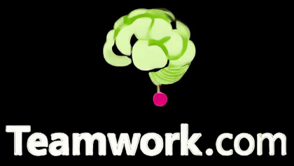

# Teamwork.com AI

**Unofficial** extension for [Teamwork.com](https://teamwork.com) to integrate
AI capabilities.

> [!WARNING]
> When interacting with LLMs, be aware that the data you provide may be used to
> train and improve AI models. This may include sharing your data with
> third-party providers, which could lead to potential privacy and security
> risks. Always review the terms of service and privacy policies of the AI
> providers you use to understand how your data will be handled.

## MCP server

The MCP server was moved to the official Teamwork.com repository:
https://github.com/teamwork/mcp

## Assigner

The assigner is a webservice that integrates with Teamwork.com webhooks,
handling task creation and updates. It behave as an Agentic AI, extracting
skills and job roles from the task and assigning the best user to fulfill it.

**For more information check [our documentation](cmd/assigner/README.md).**