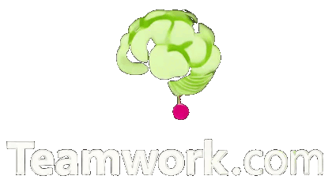

# Teamwork.com AI

[](https://pkg.go.dev/github.com/rafaeljusto/teamwork-ai)




**Unofficial** extension for [Teamwork.com](https://teamwork.com) to integrate
AI capabilities.

> [!WARNING]
> When interacting with LLMs, be aware that the data you provide may be used to
> train and improve AI models. This may include sharing your data with
> third-party providers, which could lead to potential privacy and security
> risks. Always review the terms of service and privacy policies of the AI
> providers you use to understand how your data will be handled.

## MCP server

Implements the Model Context Protocol (MCP) to allow AI agents to interact with
Teamwork.com. This server acts as a bridge between AI clients and Teamwork.com,
adding tools to create tasks, projects, and more.

[](https://www.youtube.com/watch?v=QTGM7cQT7Ew)

Some interesting things you can do with this server:

```
> Could you please create a projects with the steps to create a new house?

The AI client will create a project named "New House" with tasklist and tasks
with the specific steps to create a new house.
```

```
> Could you assign the tasks from the "New House" project to users that have
> the available skills to fulfill them? Leave the tasks unassigned if no
> user has the required skills.

The AI client will automatically query the projects, project's members, 
tasklists, tasks and skills to correctly assign the tasks. It analyzes the
tasklist name, the task title and description to find the best match for the
users' skills.
```

**For more information check [our documentation](cmd/mcp/README.md).**

## Assigner

The assigner is a webservice that integrates with Teamwork.com webhooks,
handling task creation and updates. It behave as an Agentic AI, extracting
skills and job roles from the task and assigning the best user to fulfill it.

[](https://www.youtube.com/watch?v=syeb50mia_M)

**For more information check [our documentation](cmd/assigner/README.md).**

## Summarizer

The summarizer is a command-line tool that generates summaries of activities
from a Teamwork.com account within a specified date range. It can optionally
target a specific project.

**For more information check [our documentation](cmd/summarizer/README.md).**